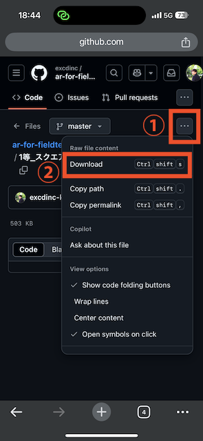

## 無人航空機操縦者技能証明 
# 実地試験コース AR(拡張現実)コンテンツ
 
無人航空機操縦者技能証明 実地試験のコースをARで作成しました。  
iPhoneやiPadの画面で現実空間上にコースを映すことが出来ます。  
これを使えばメジャーを使わなくても、画面を見ながらコーンの配置やラインを引いたりしてコースを作成することが出来ます。  
 
概要や使用方法は以下の動画をご参照ください。  

- 動作環境：iPhone,iPadなどのiOSデバイス
- 使用アプリ：ファイルアプリ
- 使用方法：.usdzファイルをダウンロードし、ファイルアプリで開いてください。

ダウンロード方法

いずれかの.usdzファイルをタップ

右上のメニューボタンからダウンロードを選択してください。

### 補足事項
- アプリ内ブラウザで開いている場合はデフォルトブラウザで開いてからダウンロードしてください。
- 一度ダウンロードしたら、ファイルアプリに自動で保存されていますので、2回目以降はファイルアプリからusdzファイルを開くことができます。
- usdzファイルがARで表示できなくなった場合は一度ファイルアプリを落とし、再度ファイルアプリを開いて、
最近開いた項目からusdzファイルを開いてください。

---

## Remote Pilot Skill Certification  
# AR Practice Course (Augmented Reality)

This project provides an AR version of the practical test course for drone remote pilot certification.  
You can project the course into real space using an iPhone or iPad screen.  
Using this AR content, you can place cones and draw lines without needing a physical tape measure.

See the following video for details and instructions:

- Supported devices: iOS devices (iPhone/iPad)  
- Required app: Files app  
- How to use: Download the `.usdz` file and open it in the Files app.

### Download Instructions

1. Tap on any `.usdz` file  
2. Select "Download" from the top-right menu

### Notes

- If you're using an in-app browser, please switch to your default browser to download.  
- Once downloaded, the file will be saved in the Files app automatically.  
- If AR rendering fails, close the Files app and reopen it, then try opening the `.usdz` file again.

---

## ライセンス / License

このリポジトリに含まれる `.usdz` ファイルおよびその他の関連ファイルは、MITライセンスのもとで公開されています。  
詳しくは [LICENSE](./LICENSE) ファイルをご覧ください。

The `.usdz` files and related assets in this repository are licensed under the MIT License.  
See the [LICENSE](./LICENSE) file for details.

